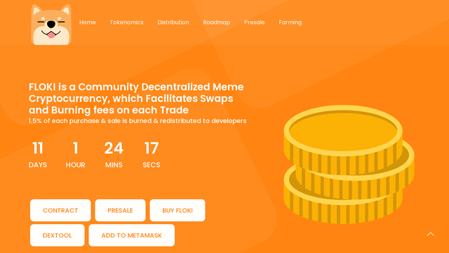

# Floki Shiba Inu

- Is a Community Decentralized Meme Cryptocurrency, which Facilitates Swaps and Burning fees on each Trade.

- Good token for good people.

## Specification
<table>
<tr><td>Coin Name</td><td>Floki Shiba Inu</td></tr>
<tr><td>Ticker</td><td>FLOKI</td></tr>
<tr><td>Coin Type</td><td>Binance Smart Chain (BEP20)</td></tr>
<tr><td>Total Supply</td><td>2.000.000.000</td></tr>
<tr><td>Decimals</td><td>8</td></tr>
<tr><td>Contract Address</td><td>0x3f8fe95b8a23957f7597c17fb69edc4cadcda67c</td></tr>
<tr><td>Website</td><td>https://flokishiba.space</td></tr>
<tr><td>White Paper</td><td>https://flokishiba.space/whitepaper.pdf</td></tr>
</table>